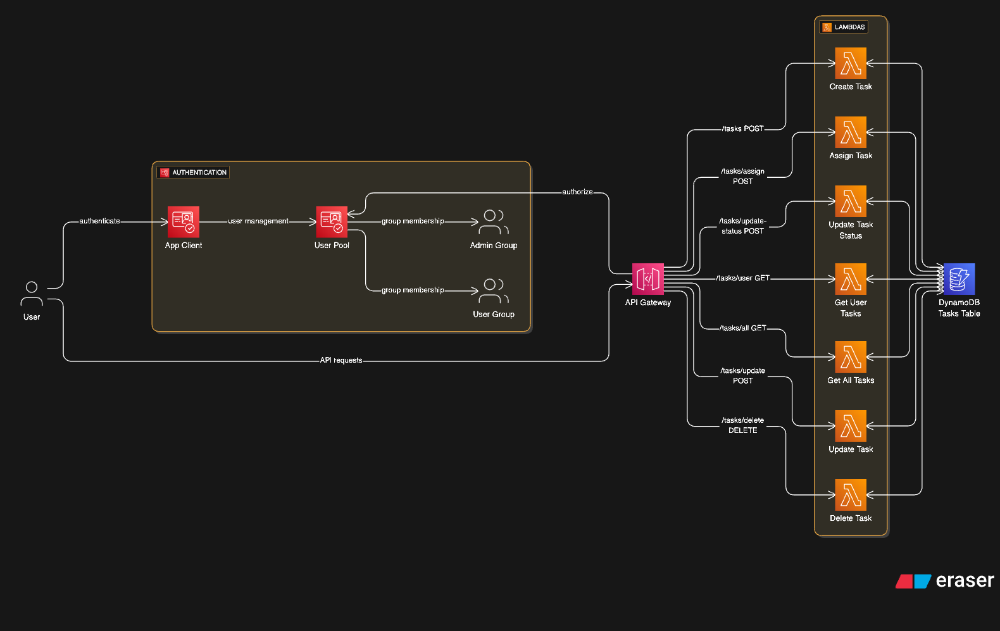
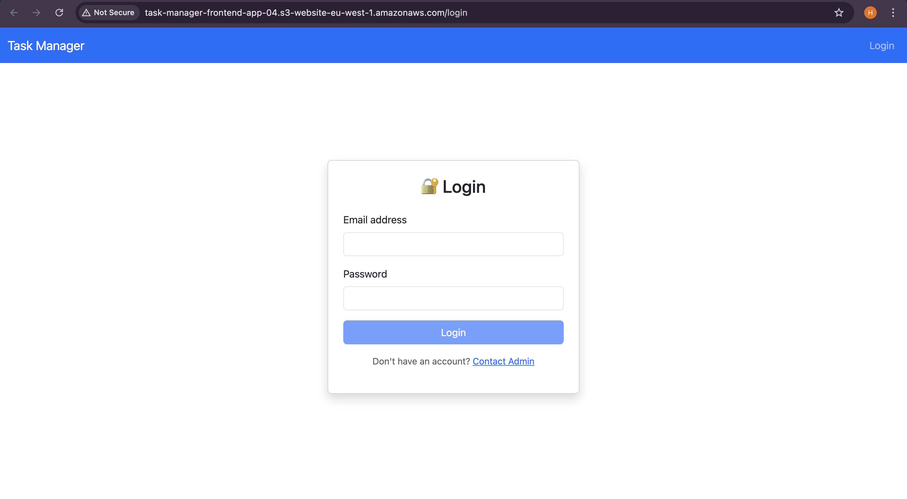
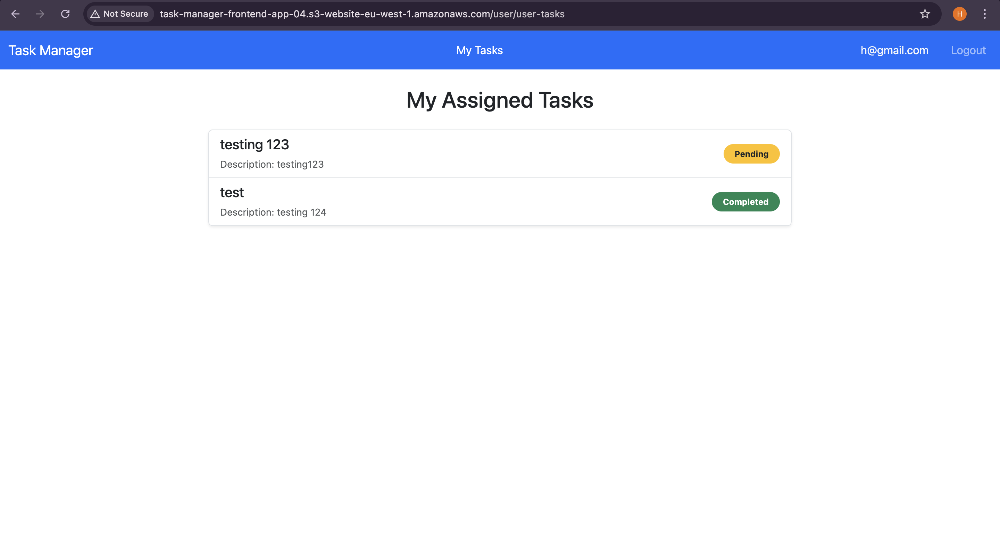
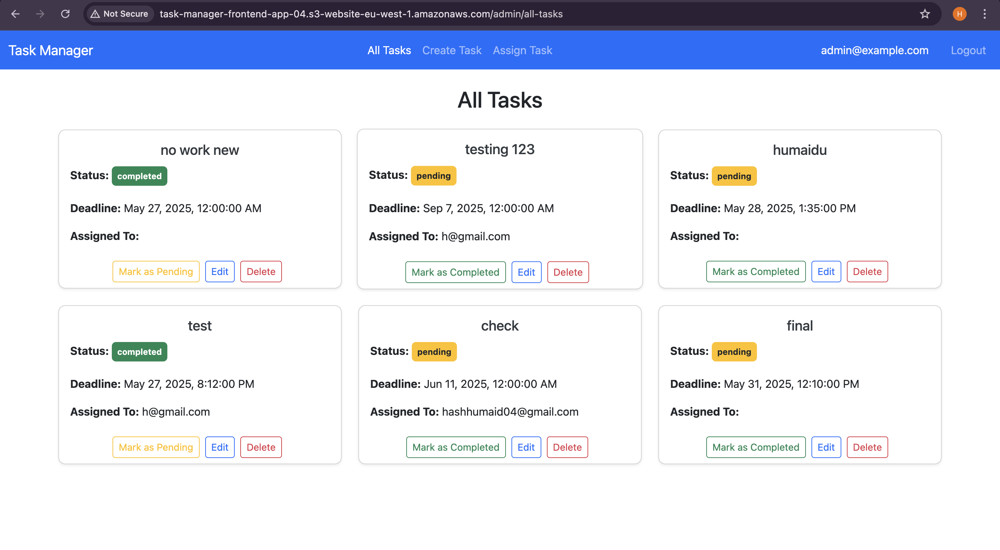

# Serverless Task Manager

A full-stack, serverless **Task Management System** built with Angular (frontend) and AWS services including **Cognito** for authentication and **Lambda/API Gateway** for the backend.

---

## Architecture Diagram



---
## Live App

- *http://task-manager-frontend-app-04.s3-website-eu-west-1.amazonaws.com*

---

## 🔗 Project Repository

GitHub: [https://github.com/Humaidu/serverless-task-manager](https://github.com/Humaidu/serverless-task-manager)

---

## 🛠️ Tech Stack

| Layer         | Technology               |
|---------------|--------------------------|
| Frontend      | Angular                  |
| Authentication| AWS Cognito (Hosted UI)  |
| Authorization | Cognito User Groups      |
| API Gateway   | Amazon API Gateway       |
| Backend       | AWS Lambda (Node.js/Python) |
| HTTP Client   | Axios + Axios Interceptor |
| Deployment    | AWS SAM / CDK (infra-as-code) |

---

## Features

- AWS Cognito Login via Hosted UI
- User Roles:
  - **User**: Can only view their assigned tasks
  - **Admin**: Can create, assign, update, delete tasks and change task status
- Role-based protected routes using Angular guards
- Axios instance (`axiosInstance`) handles token injection via interceptor
- Secure JWT authentication
- Responsive UI for task management

---

## Task Manager App UI

### Login/Home Page


---
### User Page


---
### Admin Page


---

## Clone the Repo

```bash
git clone https://github.com/Humaidu/serverless-task-manager.git
cd serverless-task-manager
npm install
```
---

## Roles and Access

### User

- Allowed Actions:

    - View assigned tasks: GET /api/user/tasks

### Admin

- Allowed Actions:

    - Create task: POST /api/admin/task
    - Assign task: PUT /api/admin/task/:id/assign
    - Update task: PUT /api/admin/task/:id
    - Change task status: PUT /api/admin/task/:id/status
    - Delete task: DELETE /api/admin/task/:id

---

### API Endpoints

*API URL*: https://p8ej9c9pi1.execute-api.eu-west-1.amazonaws.com/prod/

| Role  | Endpoint                        | Method | Description              |
|-------|----------------------------------|--------|--------------------------|
| User  | `/api/user/tasks`              | GET    | Get assigned tasks       |
| Admin | `/api/user/tasks/all`          | GET    | Get all tasks     |
| Admin | `/api/admin/task`              | POST   | Create a task            |
| Admin | `/api/admin/task/:id/assign`   | POST    | Assign task to user      |
| Admin | `/api/admin/task/:id`          | PUT    | Update task details      |
| Admin | `/api/admin/task/:id/status`   | PUT    | Update task status       |
| Admin | `/api/admin/task/:id`          | DELETE | Delete task              |

---
## Admin: Add Users to Cognito

The script [create_user.py](backend/task-manager-backend/create_user.py) allows an administrator to create a new user in the AWS Cognito User Pool, assign a temporary password, and add the user to a specified group (e.g., Admin, User, etc.). This setup enables the user to sign in via the frontend application and forces them to change their password to a permanent one on first login, improving security.

---
### Usage
- Make sure you have a `.env file` in the root of the project with the following variables set:
    ```
    USER_POOL_ID=your_cognito_user_pool_id
    USERNAME=user@example.com
    PASSWORD=TemporaryPassword123!
    GROUP_NAME=User  # or Admin

    ```

- Run the script

    ```
    python scripts/create_user.py

    ```

- On success, you will see a confirmation:

    ```
    User user@example.com created with temporary password and added to User.
    User user@example.com will be required to change password on first login.

    ```
---

### What happens on first login?

- When the user logs in for the first time using the temporary password, AWS Cognito triggers the `NEW_PASSWORD_REQUIRED` challenge.
- The frontend detects this challenge and redirects the user to a Set New Password form.
- The user enters their new permanent password in this form.
- Upon successful password update, the user can then log in normally with the new password.

---
### Notes

- The script creates users with a temporary password, not a permanent one.
- The frontend is responsible for handling the `NEW_PASSWORD_REQUIRED` challenge flow to force the password update.
- This approach improves security by ensuring users set their own permanent passwords.
- The MessageAction='SUPPRESS' prevents Cognito from sending a welcome email.

---
## Future Enhancements

- Email notifications via Amazon SES
- Task history logs
- PWA capabilities

---

## Frontend Readme
**Readme**: [https://github.com/Humaidu/serverless-task-manager/frontend/README.md](https://github.com/Humaidu/serverless-task-manager/blob/main/frontend/README.md)

---
## Backend Readme

**Readme**: [https://github.com/Humaidu/serverless-task-manager/backend/README.md](https://github.com/Humaidu/serverless-task-manager/blob/main/backend/README.md)
